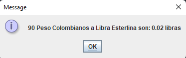
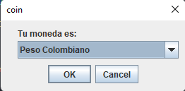
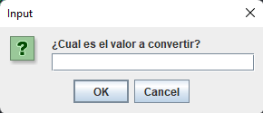
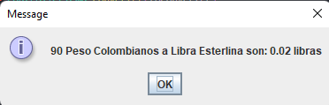

# Conversor de Monedas - Challenge ONE Oracle + Alura Latam

Esta es una solución para [One Oracle + Alura Latam](https://www.aluracursos.com/challenges/oracle-one-java). Los Challenge se basan en el concepto Challenge Based Learning, es decir, un aprendizaje centrado en desafíos que Apple ayudó a crear y que se basa en 3 pilares: Compromiso, Investigación y realización.

## Table of contents

- [Overview](#overview)
  - [The challenge](#the-challenge)
  - [Screenshot](#screenshot)
  - [Links](#links)
- [My process](#my-process)
  - [Built with](#built-with)
- [Author](#author)

## Overview

### The challenge

En esta oportunidad, a los Devs se nos solicitó crear un conversor de divisas utilizando el lenguaje Java. Las características solicitadas por nuestro cliente son las siguientes:

** Requisitos: **
- El convertidor de moneda debe:

           - Convertir de la moneda de tu país a Dólar
           - Convertir de la moneda de tu país  a Euros
           - Convertir de la moneda de tu país  a Libras Esterlinas
           - Convertir de la moneda de tu país  a Yen Japonés
           - Convertir de la moneda de tu país  a Won sul-coreano

Recordando que también debe ser posible convertir inversamente, es decir:

           - Convertir de Dólar a la moneda de tu país
           - Convertir de Euros a la moneda de tu país
           - Convertir de Libras Esterlinas a la moneda de tu país
           - Convertir de Yen Japonés a la moneda de tu país
           - Convertir de Won sul-coreano a la moneda de tu país

### Screenshot

### Links

- Solution URL: [Github.com](https://github.com/Yosoyteamc/converter-whit-java.git)

## My process

### Built with

- Java OO
- Java.swing

## Author

- Linkedin - [Juan Mosquera](https://www.linkedin.com/in/juanmosquera98/)
- Frontend Mentor - [@yosoyteamc](https://www.frontendmentor.io/profile/Yosoyteamc)
- Instagram - [@yosoyteamc](https://www.instagram.com/yosoyteamc/)
